# 🏦 PIX Banking System - AWS Cloud Infrastructure

<div align="center">

[](https://www.terraform.io/)
[](https://aws.amazon.com/)
[](https://kubernetes.io/)
[](https://www.python.org/)
[](https://www.docker.com/)

**Sistema bancário completo para transferências PIX com arquitetura de microserviços na AWS**

[📋 Documentação](#-índice) • [🚀 Quick Start](#-quick-start) • [📊 Evidências](#-evidências) • [💰 Custos](#-custos)

</div>

---

## 🌐 Rancher Dashboard

<div align="center">

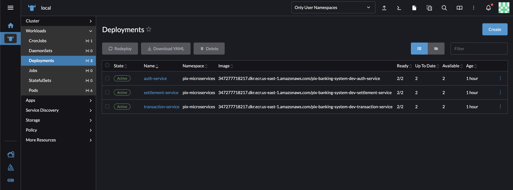

**🔗 Acesso ao Rancher:**  
**URL:** https://a51ac781483a549b3b6937162f4eae27-440043048.us-east-1.elb.amazonaws.com/dashboard/home  
**Login:** `admin` | **Senha:** `Admin123!`

</div>

---

## 📋 Índice

- [🏗️ Arquitetura](#️-arquitetura)
- [🛠️ Tecnologias](#️-tecnologias)
- [📦 Infraestrutura AWS](#-infraestrutura-aws)
- [🚀 Microserviços](#-microserviços)
- [⚙️ Deploy](#️-deploy)
- [📊 Evidências do Projeto](#-evidências-do-projeto)
- [💰 Estimativa de Custos](#-estimativa-de-custos)
- [🧹 Limpeza](#-limpeza)
- [👨‍💻 Autor](#-autor)

---

## 🏗️ Arquitetura

### 📐 Visão Geral da Arquitetura

> **💡 Dica:** Importe o arquivo `docs/architecture-diagram.xml` no [Draw.io](https://app.diagrams.net/) para visualizar a arquitetura completa e interativa!
```
┌─────────────────────────────────────────────────────────────────────┐
│                          ☁️  AWS Cloud VPC                          │
│                         (10.0.0.0/16)                               │
├─────────────────────────────────────────────────────────────────────┤
│                                                                     │
│  ┌──────────────┐          ┌────────────────────────────────────┐ │
│  │   🌐 ALB     │  HTTP    │      🎯 EKS Cluster 1.28           │ │
│  │   Ingress    │─────────▶│                                    │ │
│  │  Controller  │          │  ┌──────────────────────────────┐  │ │
│  └──────────────┘          │  │  🐍 Auth Service             │  │ │
│         │                  │  │     (Python 3.11 + Flask)    │  │ │
│         │                  │  │     Replicas: 2              │  │ │
│         ▼                  │  └──────────────────────────────┘  │ │
│  ┌──────────────┐          │                                    │ │
│  │  📡 Route53  │          │  ┌──────────────────────────────┐  │ │
│  │    (DNS)     │          │  │  💸 Transaction Service      │  │ │
│  └──────────────┘          │  │     (Python 3.11 + Flask)    │  │ │
│                            │  │     Replicas: 2 (HPA 2-5)    │  │ │
│                            │  └──────────────────────────────┘  │ │
│                            │                                    │ │
│                            │  ┌──────────────────────────────┐  │ │
│                            │  │  ⚖️  Settlement Service      │  │ │
│                            │  │     (Python 3.11 + Flask)    │  │ │
│                            │  │     Replicas: 2              │  │ │
│                            │  │     CronJob: */6h            │  │ │
│                            │  └──────────────────────────────┘  │ │
│                            └────────────────────────────────────┘ │
│                                         │                          │
│                    ┌────────────────────┼────────────────────┐     │
│                    ▼                    ▼                    ▼     │
│         ┌──────────────────┐  ┌──────────────┐  ┌──────────────┐  │
│         │   📊 DynamoDB    │  │  📮 SNS      │  │  📬 SQS      │  │
│         │                  │  │  Topic       │  │  Queue       │  │
│         │  • users         │  │              │  │              │  │
│         │  • accounts      │  │  Pub/Sub     │  │  FIFO        │  │
│         │  • transactions  │  │  Notif.      │  │  Async       │  │
│         │  • pixkeys       │  └──────────────┘  └──────────────┘  │
│         │  • notifications │                                       │
│         └──────────────────┘                                       │
│                    │                                               │
│         ┌──────────┴──────────┐        ┌──────────────┐           │
│         ▼                     ▼        │   🐳 ECR     │           │
│  ┌──────────────┐    ┌──────────────┐  │              │           │
│  │ 🔥 ElastiCache│    │  🖼️  ECR     │  │  Repos: 3    │           │
│  │    Redis      │    │   Images     │  │  • auth      │           │
│  │  (t3.micro)   │    │              │  │  • trans.    │           │
│  │               │    │  Multi-Stage │  │  • settl.    │           │
│  │  Cache + Auth │    │  Dockerfile  │  └──────────────┘           │
│  └──────────────┘    └──────────────┘                             │
│                                                                     │
└─────────────────────────────────────────────────────────────────────┘
```

### 🔐 Segurança e Rede
```
📡 Internet Gateway
    │
    ▼
┌─────────────────────────────────┐
│    Public Subnets (2 AZs)       │
│  • NAT Gateway                  │
│  • Application Load Balancer    │
└─────────────────────────────────┘
    │
    ▼
┌─────────────────────────────────┐
│   Private Subnets (2 AZs)       │
│  • EKS Worker Nodes             │
│  • Microservices Pods           │
│  • Network Policies (Isolation) │
└─────────────────────────────────┘
    │
    ▼
┌─────────────────────────────────┐
│   AWS Managed Services          │
│  • DynamoDB (VPC Endpoint)      │
│  • ElastiCache (Private)        │
│  • SNS/SQS                      │
└─────────────────────────────────┘
```

---

## 🛠️ Tecnologias

<table>
<tr>
<td width="50%">

### ☁️ **Cloud & Infrastructure**
-  **Terraform** - IaC
-  **AWS** - Cloud Provider
-  **EKS** - Container Orchestration
-  **Docker** - Containerization

### 🗄️ **Databases & Storage**
-  **DynamoDB** - NoSQL
-  **ElastiCache** - In-Memory Cache

</td>
<td width="50%">

### 💬 **Messaging & Events**
-  **SNS** - Pub/Sub
-  **SQS** - Message Queue

### 🐍 **Backend**
-  **Python** - Language
-  **Flask** - Web Framework
-  **Boto3** - AWS SDK

### 🔧 **DevOps**
-  **Helm** - K8s Package Manager
-  **Rancher** - K8s Management

</td>
</tr>
</table>

---

## 📦 Infraestrutura AWS

### 📊 Recursos Provisionados

<table>
<tr>
<th>🏗️ Categoria</th>
<th>📦 Recurso</th>
<th>🔢 Quantidade</th>
<th>📝 Descrição</th>
</tr>
<tr>
<td rowspan="4"><b>🌐 Networking</b></td>
<td>VPC</td>
<td align="center">1</td>
<td>Rede privada (10.0.0.0/16)</td>
</tr>
<tr>
<td>Subnets Privadas</td>
<td align="center">2</td>
<td>Workloads (us-east-1a, us-east-1b)</td>
</tr>
<tr>
<td>Subnets Públicas</td>
<td align="center">2</td>
<td>ALB + NAT Gateway</td>
</tr>
<tr>
<td>NAT Gateway</td>
<td align="center">2</td>
<td>Conectividade internet (HA)</td>
</tr>
<tr>
<td rowspan="2"><b>⚙️ Compute</b></td>
<td>EKS Cluster</td>
<td align="center">1</td>
<td>Kubernetes 1.28</td>
</tr>
<tr>
<td>EC2 Worker Nodes</td>
<td align="center">2-3</td>
<td>t3.small (auto-scaling)</td>
</tr>
<tr>
<td rowspan="2"><b>🗄️ Database</b></td>
<td>DynamoDB Tables</td>
<td align="center">5</td>
<td>users, accounts, transactions, pixkeys, notifications</td>
</tr>
<tr>
<td>ElastiCache Redis</td>
<td align="center">1</td>
<td>t3.micro (cache + sessions)</td>
</tr>
<tr>
<td rowspan="2"><b>📬 Messaging</b></td>
<td>SNS Topic</td>
<td align="center">1</td>
<td>Notificações de transações</td>
</tr>
<tr>
<td>SQS Queue</td>
<td align="center">1</td>
<td>Processamento assíncrono</td>
</tr>
<tr>
<td rowspan="2"><b>🐳 Container</b></td>
<td>ECR Repositories</td>
<td align="center">3</td>
<td>Imagens Docker dos microserviços</td>
</tr>
<tr>
<td>ALB</td>
<td align="center">1</td>
<td>Application Load Balancer</td>
</tr>
</table>


## 🚀 Microserviços

### 🏗️ Arquitetura de Microserviços

<table>
<tr>
<th width="30%">🎯 Serviço</th>
<th width="70%">📋 Detalhes</th>
</tr>

<tr>
<td>

### 🔐 **Auth Service**
**Porta:** `3000`  
**Réplicas:** `2`  
**HPA:** Não configurado

</td>
<td>

**📡 Endpoints:**
- `GET /health` - Health check
- `POST /api/auth/register` - Cadastro de usuário + conta
- `POST /api/auth/login` - Autenticação (JWT)
- `GET /api/auth/users/:id` - Buscar usuário

**🔗 Dependências:**
- 📊 DynamoDB: `users`, `accounts`
- 🔥 Redis: Cache de tokens JWT

</td>
</tr>

<tr>
<td>

### 💸 **Transaction Service**
**Porta:** `3000`  
**Réplicas:** `2-5 (HPA)`  
**Scaling:** CPU > 70%

</td>
<td>

**📡 Endpoints:**
- `GET /health` - Health check
- `POST /api/transactions` - Criar transação PIX
- `GET /api/transactions/:id` - Consultar transação

**🔗 Dependências:**
- 📊 DynamoDB: `transactions`, `accounts`, `pixkeys`
- 🔥 Redis: Cache de transações
- 📮 SNS: Publicar notificações

</td>
</tr>

<tr>
<td>

### ⚖️ **Settlement Service**
**Porta:** `3000`  
**Réplicas:** `2`  
**CronJob:** `*/6h`

</td>
<td>

**📡 Endpoints:**
- `GET /health` - Health check
- `POST /api/settlement/process` - Processar liquidação
- `GET /api/settlement/report` - Relatório de transações

**🔗 Dependências:**
- 📊 DynamoDB: `transactions`, `accounts`
- 📬 SQS: Consumir fila de liquidação
- 📮 SNS: Publicar status

</td>
</tr>
</table>

---

## ⚙️ Deploy

### 🚀 Quick Start

#### 📋 **Pré-requisitos**
```bash
# Ferramentas necessárias
✅ AWS CLI 2.x
✅ Terraform 1.5+
✅ kubectl 1.28+
✅ Docker 20.x+
✅ Helm 3.x+
✅ jq (opcional)
```

#### 1️⃣ **Provisionar Infraestrutura AWS**
```bash
# Clonar repositório
git clone https://github.com/seu-usuario/pix-banking-system-aws.git
cd pix-banking-system-aws

# Configurar credenciais AWS
aws configure

# Navegar para o diretório do Terraform
cd infrastructure/terraform

# Inicializar Terraform
terraform init

# Planejar mudanças
terraform plan -out=tfplan

# Aplicar infraestrutura (⏱️ ~15-20 minutos)
terraform apply tfplan

# Salvar outputs importantes
terraform output > ../../terraform-outputs.txt
```

#### 2️⃣ **Configurar kubectl**
```bash
# Configurar acesso ao cluster EKS
aws eks update-kubeconfig \
  --region us-east-1 \
  --name pix-banking-system-dev-eks

# Verificar conectividade
kubectl get nodes
kubectl cluster-info
```

#### 3️⃣ **Instalar ALB Ingress Controller**
```bash
# Executar script de instalação
./scripts/04-install-alb-controller.sh

# Verificar instalação
kubectl get pods -n kube-system | grep aws-load-balancer-controller
```

#### 4️⃣ **Build e Push das Imagens Docker**
```bash
# Alterar RM_ALUNO no script
export RM_ALUNO="RM555221"

# Executar build e push
./scripts/03-build-push-images.sh

# Verificar imagens no ECR
aws ecr list-images --repository-name pix-banking-system-dev-auth-service
```

#### 5️⃣ **Deploy dos Microserviços**
```bash
# Aplicar todos os manifestos Kubernetes
./scripts/05-deploy-kubernetes.sh

# Ou aplicar manualmente
kubectl apply -f kubernetes/namespace/
kubectl apply -f kubernetes/configmap.yaml
kubectl apply -f kubernetes/secrets.yaml
kubectl apply -f kubernetes/rbac/
kubectl apply -f kubernetes/auth-service/
kubectl apply -f kubernetes/transaction-service/
kubectl apply -f kubernetes/settlement-service/
kubectl apply -f kubernetes/ingress/
```

#### 6️⃣ **Verificar Deploy**
```bash
# Ver todos os pods
kubectl get pods -n pix-microservices

# Ver serviços
kubectl get svc -n pix-microservices

# Ver ingress e pegar URL do ALB
kubectl get ingress -n pix-microservices

# Health checks
ALB_URL=$(kubectl get ingress api-gateway -n pix-microservices -o jsonpath='{.status.loadBalancer.ingress[0].hostname}')
curl http://$ALB_URL/api/auth/health
curl http://$ALB_URL/api/transactions/health
curl http://$ALB_URL/api/settlement/health
```

---

## 📊 Evidências do Projeto

### 📸 Screenshots Organizadas por Etapa

---

### 🐳 Etapa 1: Docker e Imagem Segura (1,5 pts)

#### 1.1 Build com Multi-Stage
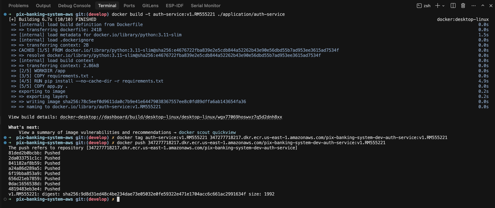

#### 1.2 Docker Push com Tag Versionada
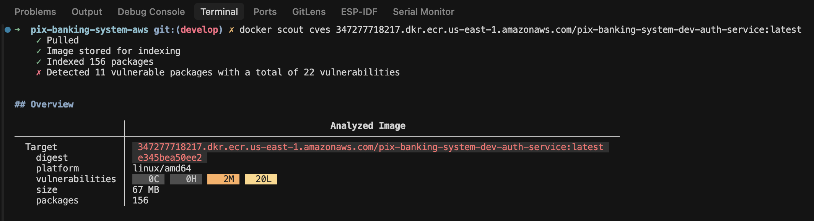

#### 1.3 Docker Scout - Scan de Vulnerabilidades
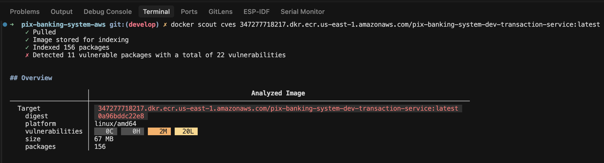
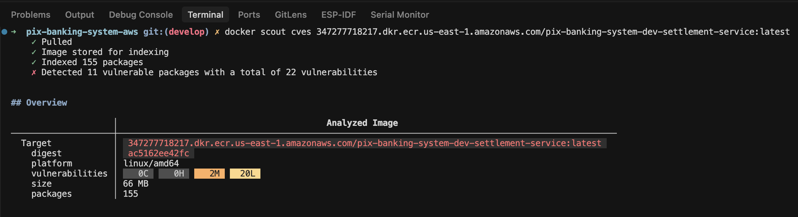

**✅ Evidências coletadas:**
- ✅ Print do `docker build` mostrando multi-stage
- ✅ Saída do `docker push` com tag v1.RM555221
- ✅ Saída do `docker scout cves` sem vulnerabilidades críticas

---

### 🌐 Etapa 2: Rede, Comunicação e Segmentação (2,5 pts)

#### 2.1 Network Policies Configuradas
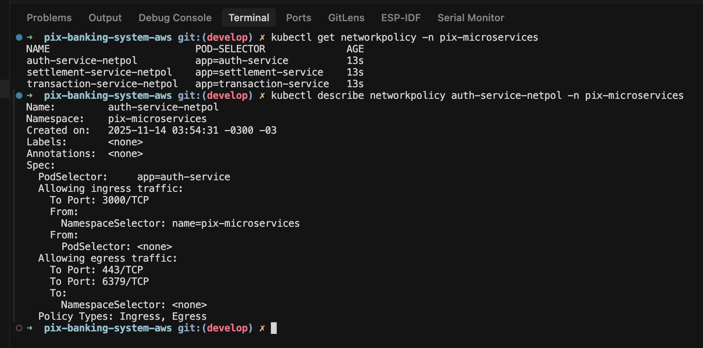
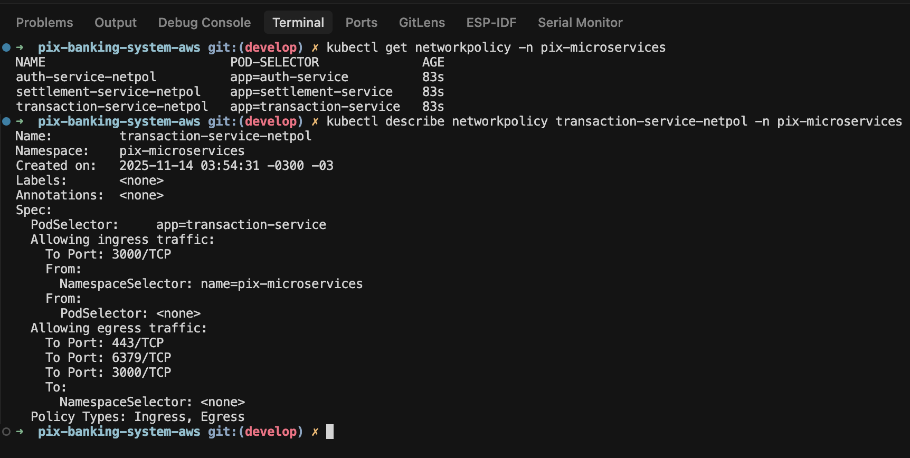
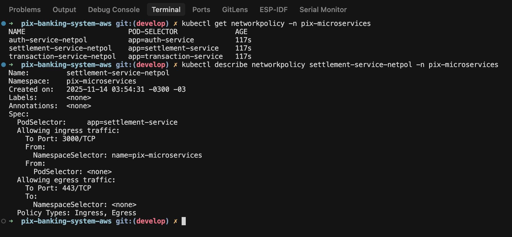

#### 2.2 Comunicação entre Pods
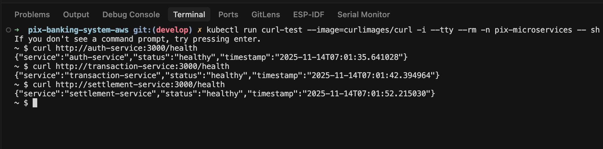

#### 2.3 Logs com Variáveis de Ambiente
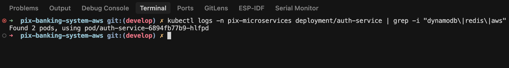
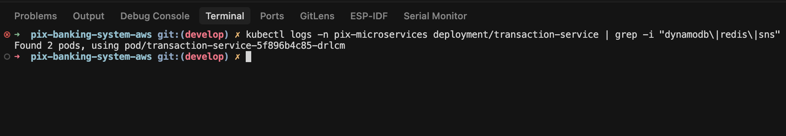
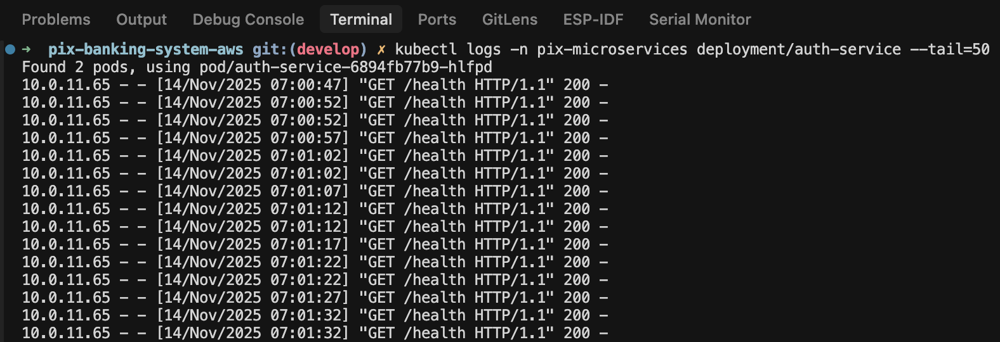

**✅ Evidências coletadas:**
- ✅ Network Policies isolando tráfego
- ✅ Curl entre containers funcionando
- ✅ Logs mostrando leitura de ConfigMaps

---

### ⚙️ Etapa 3: Kubernetes - Estrutura, Escala e Deploy (3,0 pts)

#### 3.1 Pods com 2 Réplicas
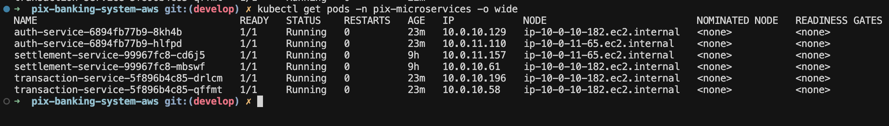

#### 3.2 Scaling de Deployments
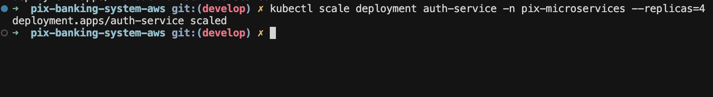
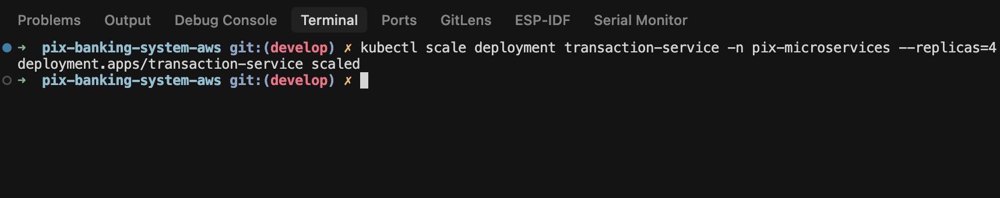
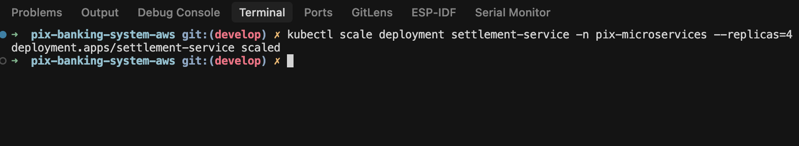

#### 3.3 Logs de Múltiplos Pods
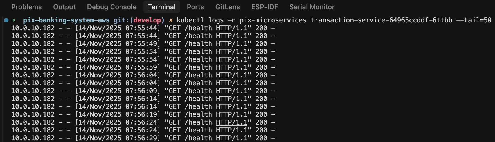

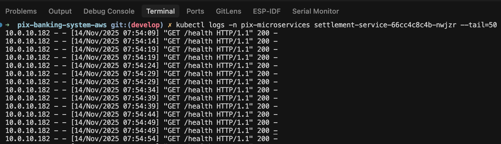

#### 3.4 CronJob Executado
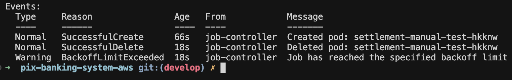
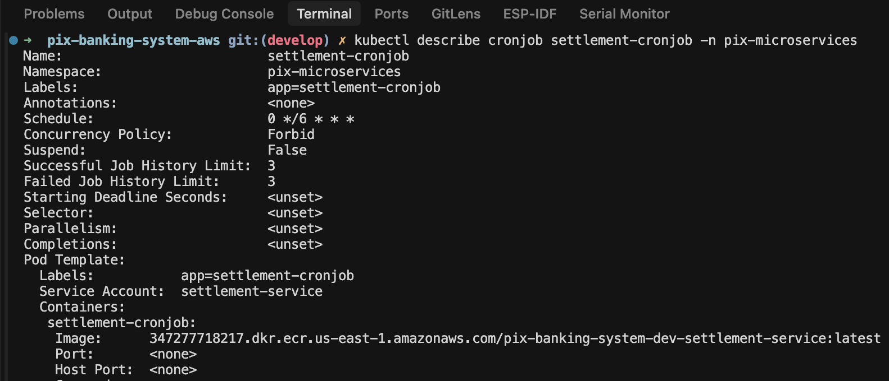

**✅ Evidências coletadas:**
- ✅ `kubectl get pods` mostrando 2 réplicas
- ✅ `kubectl scale` aumentando réplicas
- ✅ Logs de pods diferentes
- ✅ CronJob criado e executado

---

### 🔒 Etapa 4: Kubernetes - Segurança, Observação e Operação (2,0 pts)

#### 4.1 Limites de CPU/Memória
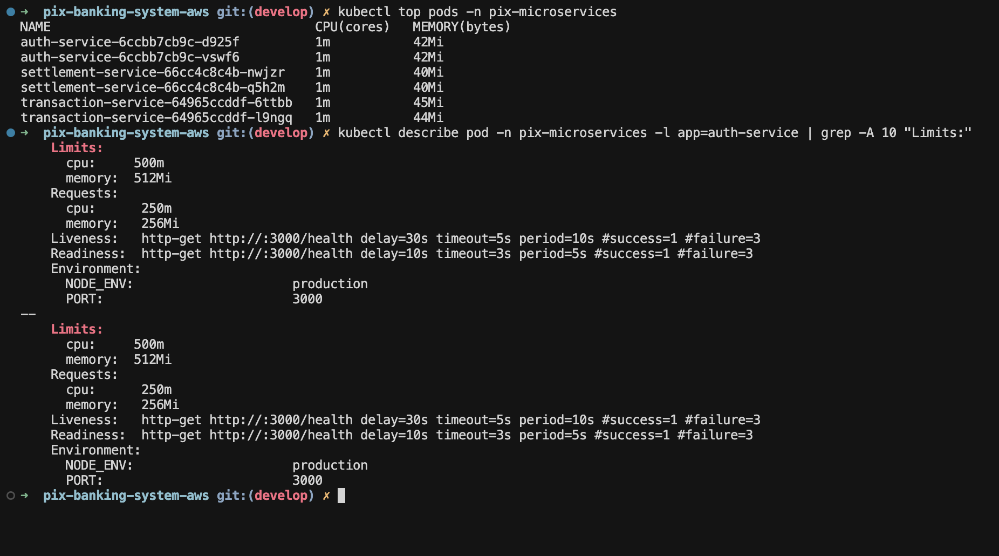

#### 4.2 SecurityContext Configurado
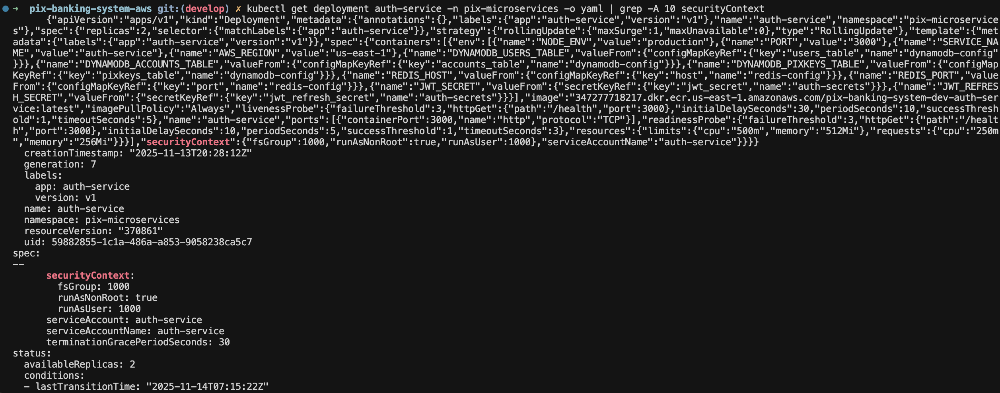
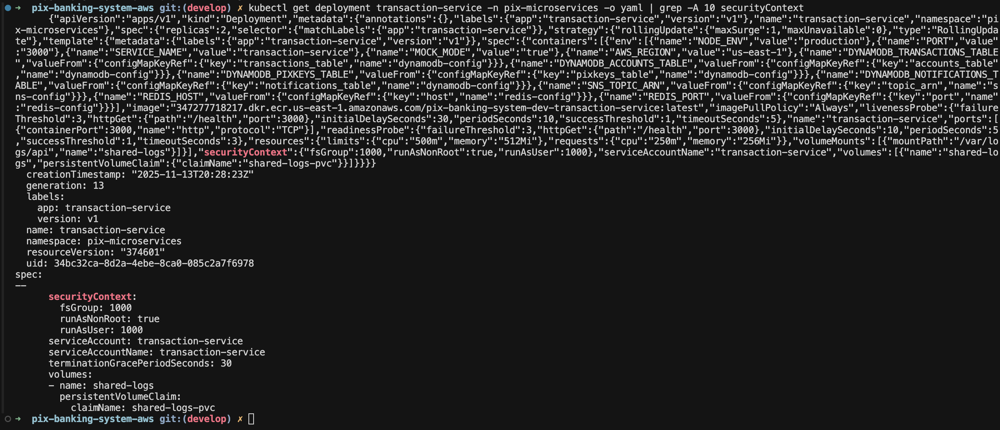

#### 4.3 Pod Inseguro Bloqueado
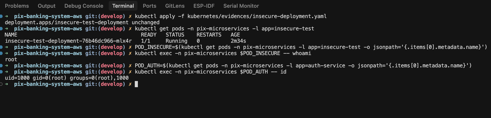

#### 4.4 Permissões Restritas (RBAC)
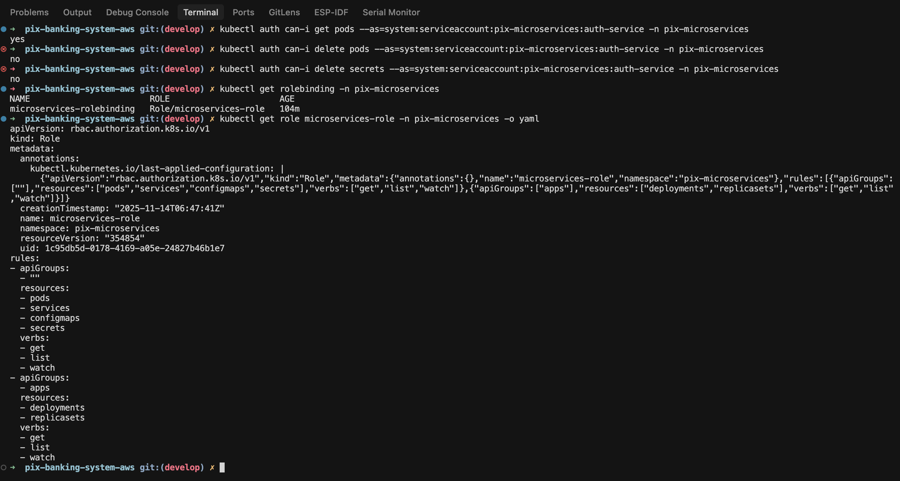
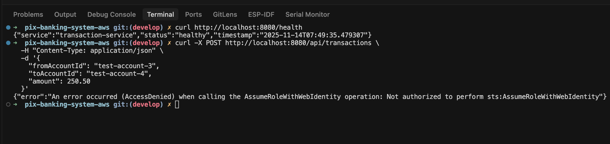

**✅ Evidências coletadas:**
- ✅ Recursos limitados (CPU/Memory)
- ✅ SecurityContext com `runAsNonRoot: true`
- ✅ Pod rodando como root (inseguro) vs non-root (seguro)
- ✅ Permissões RBAC restritas

---

### 📁 Estrutura de Evidências
```
docs/
├── rancher.png
├── architecture-diagram.xml
├── first-stage/
│   ├── docker-auth-service.png
│   ├── docker-scout-auth-service.png
│   ├── docker-scout-transaction-service.png
│   └── docker-scout-settlement-service.png
├── second-stage/
│   ├── networkpolicy-auth-service.png
│   ├── networkpolicy-transaction-service.png
│   ├── networkpolicy-settlement-service.png
│   ├── comunicação-pods.png
│   ├── logs-dynamodb-redis-auth-service.png
│   ├── logs-dynamodb-redis-transaction-service.png
│   └── comun-dynamo-redis-auth-service.png
├── third-stage/
│   ├── todos-os-pods.png
│   ├── escalar-deployment-auth-service.png
│   ├── escalar-deployment-transaction-service.png
│   ├── escalar-deployment-settlement-service.png
│   ├── logs-leitura-escrita-transaction-service.png
│   ├── logs-leitura-escrita-settlement-service.png
│   ├── cronjob-criado-settlement-service.png
│   └── detalhes-cronjob-settlement-service.png
└── fourth-stage/
    ├── k8s-top-recursos-pods.png
    ├── security-context-auth-service.png
    ├── security-context-transaction-service.png
    ├── pod-inseguro-root.png
    ├── permissões.png
    └── transação-sem-permissão.png
```

---

## 💰 Estimativa de Custos

### 💵 Breakdown Mensal

<table>
<tr>
<th>🏷️ Recurso AWS</th>
<th>⚙️ Tipo/Tamanho</th>
<th>💰 Custo/Mês (USD)</th>
</tr>
<tr>
<td>🎯 EKS Control Plane</td>
<td>Managed</td>
<td align="right"><b>$72.00</b></td>
</tr>
<tr>
<td>🖥️ EC2 Worker Nodes</td>
<td>2x t3.small</td>
<td align="right"><b>$30.00</b></td>
</tr>
<tr>
<td>🌐 NAT Gateway</td>
<td>2x AZ</td>
<td align="right"><b>$32.00</b></td>
</tr>
<tr>
<td>⚖️ Application Load Balancer</td>
<td>Internet-facing</td>
<td align="right"><b>$16.00</b></td>
</tr>
<tr>
<td>🔥 ElastiCache Redis</td>
<td>t3.micro</td>
<td align="right"><b>$12.50</b></td>
</tr>
<tr>
<td>📊 DynamoDB</td>
<td>On-Demand (5 tables)</td>
<td align="right"><b>$5.00</b></td>
</tr>
<tr>
<td>📮 SNS + 📬 SQS</td>
<td>Low traffic</td>
<td align="right"><b>$1.00</b></td>
</tr>
<tr>
<td>🐳 ECR Storage</td>
<td>3 repos (~1GB)</td>
<td align="right"><b>$0.12</b></td>
</tr>
<tr>
<td colspan="2"><b>💵 TOTAL ESTIMADO</b></td>
<td align="right"><b>~$168.62/mês</b></td>
</tr>
</table>

### 💡 Dicas para Reduzir Custos

<table>
<tr>
<th>💡 Dica</th>
<th>💰 Economia</th>
</tr>
<tr>
<td>🛑 Destruir cluster após testes</td>
<td>~$168/mês</td>
</tr>
<tr>
<td>🎯 Usar Spot Instances para workers</td>
<td>~$20/mês (70% off)</td>
</tr>
<tr>
<td>🌐 Remover 1 NAT Gateway (não HA)</td>
<td>~$16/mês</td>
</tr>
<tr>
<td>📊 DynamoDB Provisioned Capacity</td>
<td>~$3/mês</td>
</tr>
<tr>
<td>🔥 Usar Redis Spot ou t4g.micro</td>
<td>~$4/mês</td>
</tr>
</table>

---

## 🧹 Limpeza

### ⚠️ Destruir Infraestrutura
```bash
# 1. Deletar recursos Kubernetes primeiro
kubectl delete namespace pix-microservices
kubectl delete -f kubernetes/ingress/

# 2. Aguardar ALB ser deletado (~2 minutos)
kubectl get ingress --all-namespaces

# 3. Destruir infraestrutura Terraform
cd infrastructure/terraform
terraform destroy -auto-approve

# 4. Verificar recursos órfãos no AWS Console:
# - Load Balancers
# - Target Groups
# - Security Groups
# - ENIs (Network Interfaces)
```

---

## 👨‍💻 Autor

<div align="center">

### **Vinicius Prudencio**

**RM:** 555221  
**Instituição:** FIAP - Faculdade de Informática e Administração Paulista  
**Curso:** Cloud Computing & DevOps  
**Período:** Novembro 2025

[](https://linkedin.com/in/seu-perfil)
[](https://github.com/seu-usuario)
[](mailto:seu-email@example.com)

</div>

---

## 📝 Licença

Este projeto está licenciado sob a **MIT License** - veja o arquivo [LICENSE](LICENSE) para detalhes.

---

## 🎯 Próximos Passos

- [ ] 🔄 Implementar CI/CD com GitHub Actions
- [ ] 🚀 Adicionar ArgoCD para GitOps
- [ ] 🔒 Integrar Trivy para security scanning
- [ ] 📊 Configurar SonarQube para análise de código
- [ ] 📈 Implementar Prometheus + Grafana para observabilidade
- [ ] 🕸️ Adicionar Istio service mesh
- [ ] 🧪 Implementar testes automatizados (Jest + Pytest)
- [ ] 📚 Adicionar documentação Swagger/OpenAPI

---

<div align="center">

**⭐ Se este projeto foi útil, deixe uma estrela!**

Made with ❤️ by **Vinicius Prudencio** | © 2025

</div>